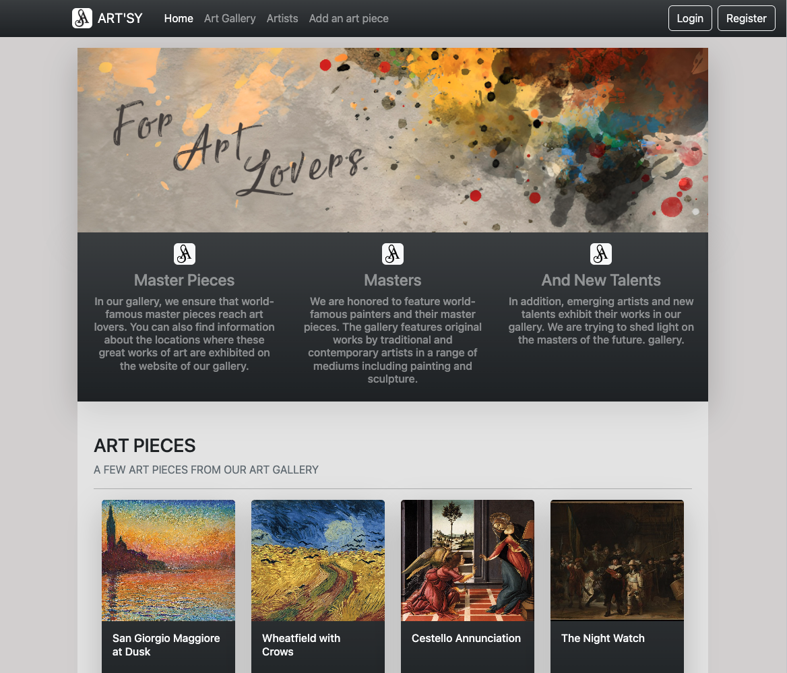
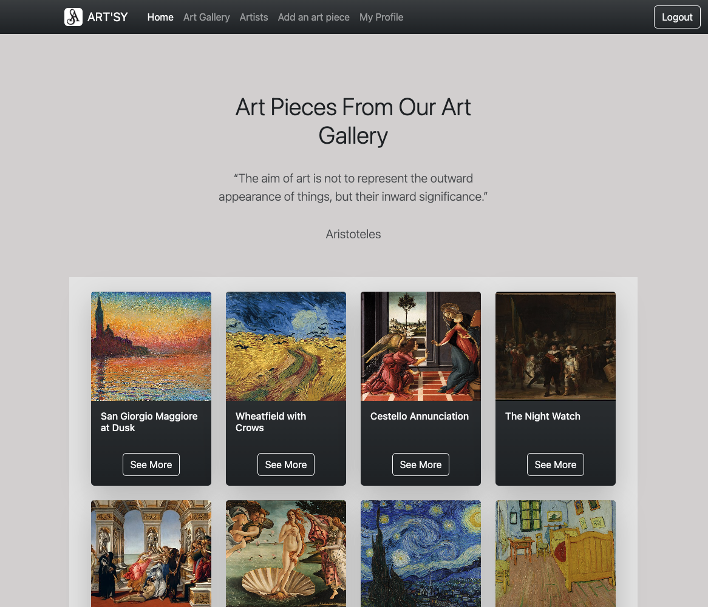

# Artsy Web App Project

## Description
Art’sy is a web application that contains a collection of art pieces and artists and allows you to see the current location of the artworks.
Aimed to collect works of art from all over the world on a single platform.

- Used three different models, including art, artist and user.
- Used Express as a foundation.
- Used Mongoose for models and database communication.
- Have validation on the models with feedback for users if their submission is invalid.
- Include sign up, log in & log out functionality with encrypted passwords and authorization.
- Implemented all CRUD actions on models.

## Intructions
- Need to install dependencies `npm install`
- Need to run the application `npm run dev`
- Need to create `.env` file with these variables:
    * PORT=3000
    * SESSION_SECRET="YOUR SECRET STRING"
    * NODE_ENV=development
    * GEOCODER_PROVIDER=mapquest
    * GEOCODER_API_KEY="YOUR API KEY"
    * CLOUDINARY_NAME="YOUR CLOUDINARY NAME"
    * CLOUDINARY_KEY="YOUR CLOUDINARY KEY"
    * CLOUDINARY_SECRET="YOUR CLOUDINARY SECRET"
    * MONGODB_URI="YOUR MONGODB URI"  

 

## Tecnologies And Tools
- ExpressJS
- NodeJS
- MongoDB Atlas
- Mongoose
- Javascript
- Geocoder
- Bycrpt
- Cloudinary
- OpenLayers
- Handlebars
- Bootstrap
- CSS3

## Demo
Here is the [demo link.](https://artsy-web-app-project.herokuapp.com/)

Happy Coding 💜